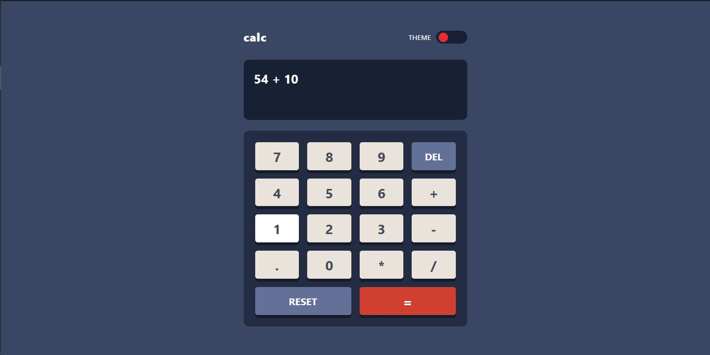
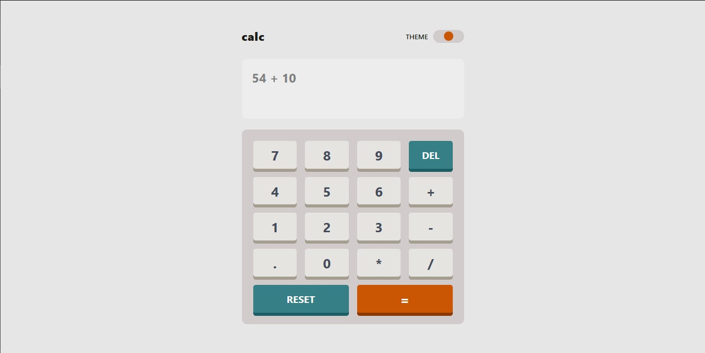
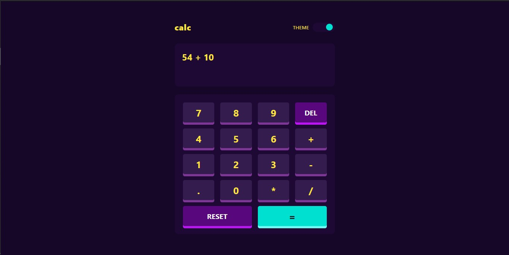
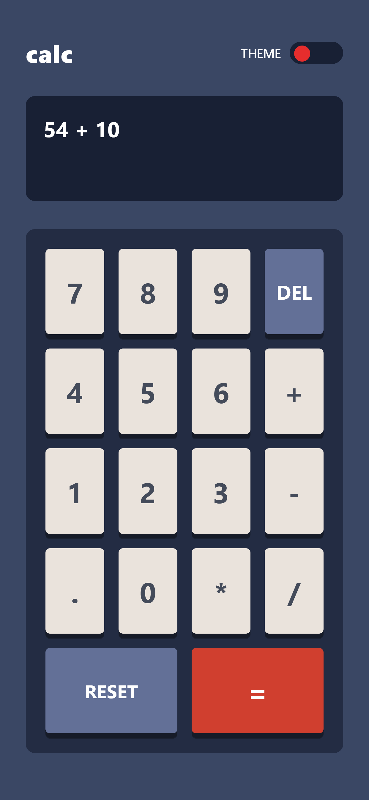

# Frontend Mentor - Calculator app solution

This is a solution to the [Calculator app challenge on Frontend Mentor](https://www.frontendmentor.io/challenges/calculator-app-9lteq5N29). Frontend Mentor challenges help you improve your coding skills by building realistic projects.

## Table of contents

- [Overview](#overview)
  - [The challenge](#the-challenge)
  - [Status](#status)
  - [Screenshot](#screenshot)
  - [Links](#links)
- [My process](#my-process)
  - [Built with](#built-with)
  - [What I learned](#what-i-learned)
  - [Useful resources](#useful-resources)

## Overview

The challenge was to implement a functional calculator whose UI was to be built according to the specified design.

### The challenge

Users should be able to:

- See the size of the elements adjust based on their device's screen size
- Perform mathmatical operations like addition, subtraction, multiplication, and division
- Adjust the color theme based on their preference
- **Bonus**: Have their initial theme preference checked using `prefers-color-scheme` and have any additional changes saved in the browser

### Status

**Almost Completed**

Theme Switching is fully implemented.
The mobile design is done.
Styles are a bit more refined.

Intial theme preferrence not checked.
Accessibility not fully catered for.

### Screenshot

#### Desktop Design

#### Mobile design

### Links

No links at the moment

## My process

I decided to use React for the UI. For the mathematical operations, I used a common application of stacks: the postfix expression. Now since JS does not offer a stack out of the box, I used the array that it does offer as a stack in the functions that convert the infix expression entered by the user into a postfix one and the one that does the calculation of the newly created postfix expression. This was accomlished by only allowing content to enter and leave the array from its end. The calculator can observe the order of precedence for the supproted operators.

This solution made it much easier for the user to enter slightly more complex calculations, which may involve multiple operators and operands.

### Built with

- Semantic HTML5 markup
- Flexbox
- CSS Grid
- [React](https://reactjs.org/) - JS library

### What I learned

I learnt the importance of data structures and algorithms as this was a very real use case for them.
I am proud of the functions in the infix-to-postfix.js file. Although they are not really complex and all, I am glad that I was able to come up with these functions (although I obtained the theory behind them from a data structures and algorithms class) and to actually implement them fairly well in a real app.

I also learned how to write JS regular expressions as using the `String.match` function was a requirement in my implementation.

### Useful resources

- [MDN JavaScript Guide - Regular Expressions](https://developer.mozilla.org/en-US/docs/Web/JavaScript/Guide/Regular_Expressions) - This made me able to use the `String.match` function.
- [The Joy of CSS Grid](https://www.youtube.com/watch?v=705XCEruZFs) - An amazing video (from the YouTube Channel Fireship) from which I learned CSS grid through the three layouts that are built form scratch in it (the video). I recommend it to anyone who wants to get started with CSS grid.
